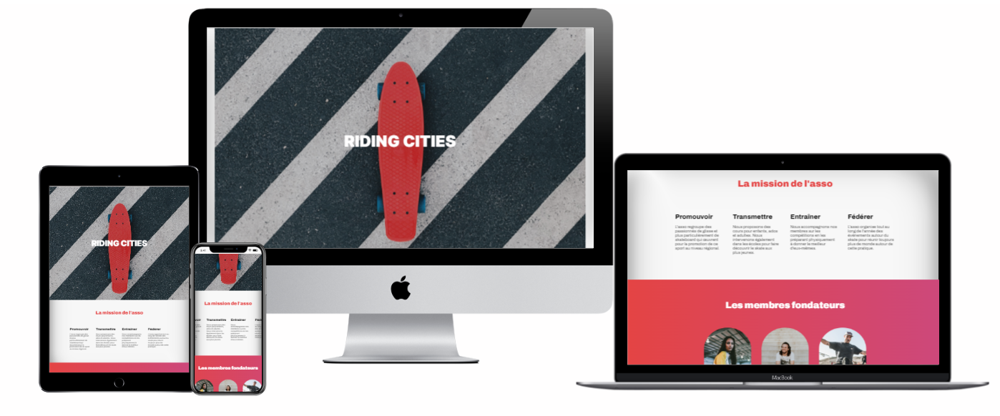

  
# Projet effectué durant ma formation Developpeur - WordPress 
<a href="https://raquel-salamone.fr/laboratoire/ridingcities/" target="_blank" alt=Rinding style="margin-top: 10px;" /> Riding-Cities</a> 

Projet 2 - ## Riding-Citites 
Premiers pas sur le langage HTML

Obectifs : 
Votre maître de stage et CTO, il vous confie votre première mission :  mettre à jour la page Internet de Riding Cities une association sportive qui promeut le skate en région. 

<a href="https://github.com/raquelsalamone/riding-cities/blob/a6aeb9ce118dc1c526528c107d142e1e3dd17cf8/riding_cities_dossier_conception.pdf" target="_blank" alt=Rinding style="margin-top: 10px;" /> Dossier conception</a> 
